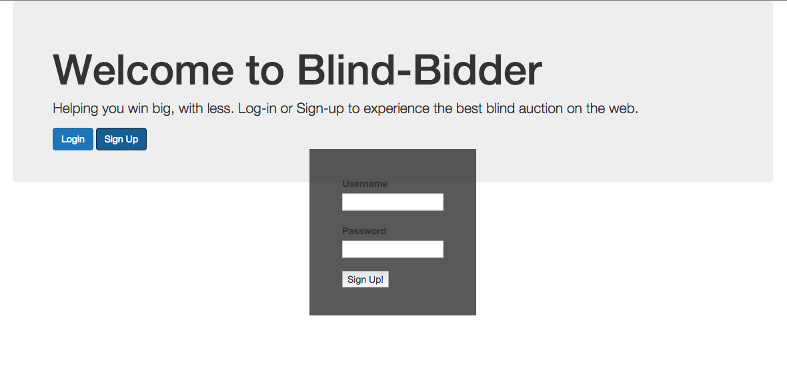
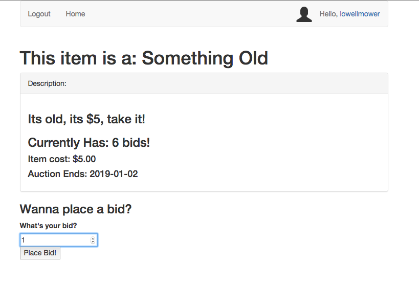
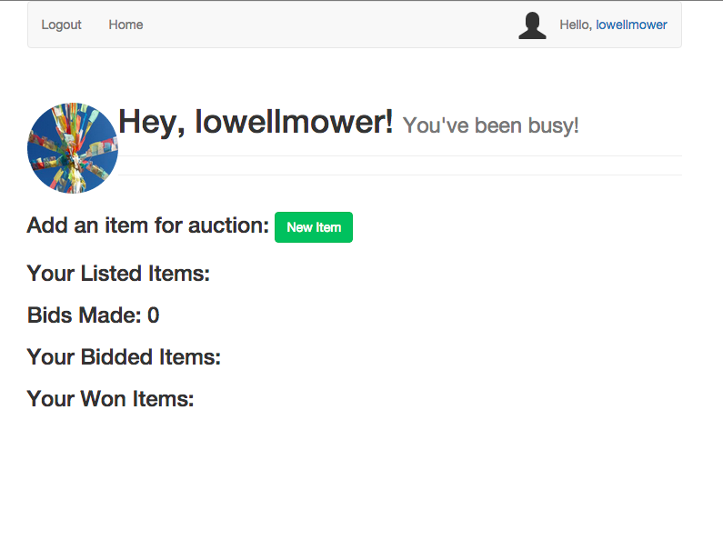

# Blind Auction

======================================

Blind Auction was a 4 hour build during a timed assessment test while on-site at Dev Bootcamp NYC. The application is meant to demonstrate the basics of CRUD, user sessioning, user authentication, and the basics of Rails routing / associations. Please excusse the poor commit history as it was moved from its parent folder which help the .git files. The project undoubtedly has the need for refactoring and is not representative of my current state of ability, however, I am keeping it in its current state as to have reference to the time in which it was produced. 

#### If you'd like to connect as see more up to date examples of my work, please feel free to reach out by [e-mail](lowell.mower@gmail.com) or twitter [@lowellmower](http://www.twitter.com/lowellmower).

### Log In:

### Post Item:

### Profile:

